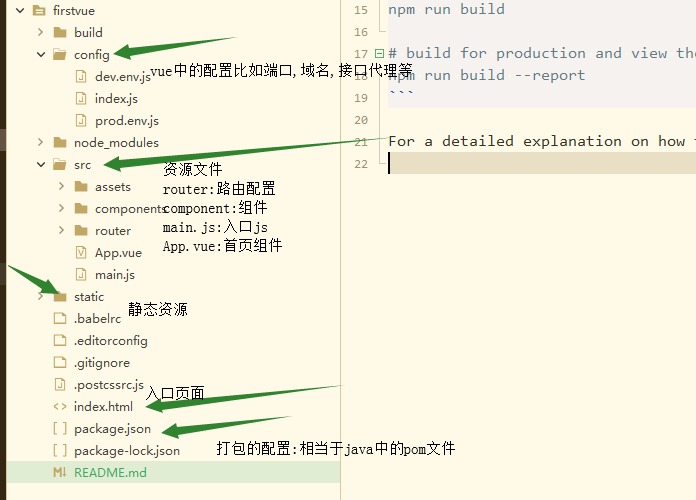
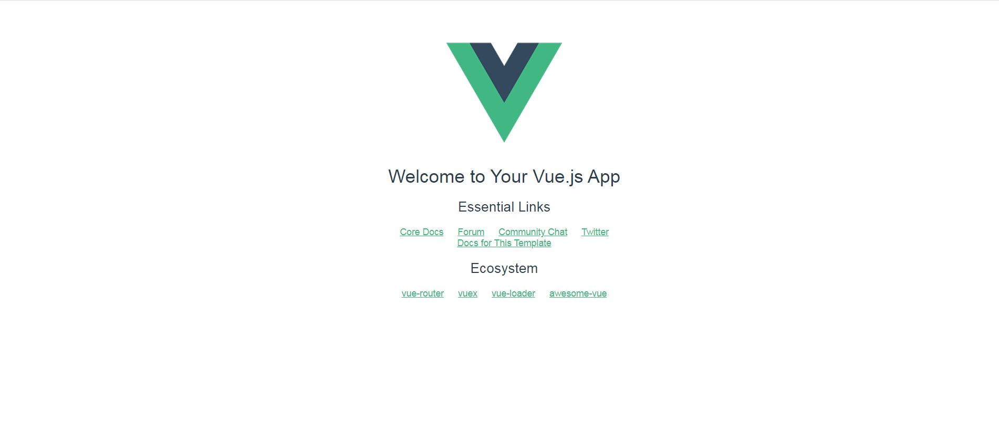



《vue初印象》首发[橙寂博客](http://www.luckyhe.com/post/81.html)转发请加此提示

## <center>vue初印象</center>

#### 前言
>上文我们已经学会了怎么去搭建一个vue的开发环境,下面我来探究一下vue默认的helloWorld这个页面是怎么出来的。

#### 项目预览





#### 项目分析

在vue中默认的加载模板是index.html然后入口是main.js通过mian.js去加载App.vue。

这里解释下为什么默认是这两个文件是入口：其实这个东西在build下面的webpack开头的js里配置的。并不是空穴来风。请看下面。

webpack的配置

```
  new HtmlWebpackPlugin({
      filename: 'index.html',
      template: 'index.html',
      inject: true
    }),

    context: path.resolve(__dirname, '../'),
  entry: {
    app: './src/main.js'
  },

```

- 默认模板index.html

```
<!DOCTYPE html>
<script src="https://cdn.jsdelivr.net/npm/vue/dist/vue.js"></script>
<html>
  <head>
      
    <meta charset="utf-8">
    <meta name="viewport" content="width=device-width,initial-scale=1.0">
    <title>y</title>
  </head>
  <body>
    <div id="app"></div>
    <!-- built files will be auto injected -->

  </body>

</html>
<script>

</script>

```
这个文件除了定义了一个id为app的div。就没啥东西了。
所以我猜测核心的东西在main.js里

- 核心js-main.js

```
// The Vue build version to load with the `import` command
// (runtime-only or standalone) has been set in webpack.base.conf with an alias.
import Vue from 'vue'
import App from './App'
import router from './router/index.js'

Vue.config.productionTip = false

/* eslint-disable no-new */
new Vue({
  el: '#app',
  router,
  components: { App },
  template: '<App/>'
})

```

这个js创建了一个vue应用并把App.vue的模板内容加载到了id为app的下面。注意这里引入了router下面的index.js页面。所以我们接下来要去看的内容应该就是App.vue跟index.js了。走起

- App.vue

```

<template>
  <div id="app">
    
    <router-view/>
  </div>
  
</template>

<script>

// 把整个页面导成模板，名字叫App
export default {
  name: 'App'
}
</script>

<style>
#app {
  font-family: 'Avenir', Helvetica, Arial, sans-serif;
  -webkit-font-smoothing: antialiased;
  -moz-osx-font-smoothing: grayscale;
  text-align: center;
  color: #2c3e50;
  margin-top: 60px;
}
</style>


```

看到这是不是有点子猛。因为这个文件除了写了Css跟引入个logo还是没看到helloWorld的内容。但是有个`<router-view/>`应该是个关键点。看这名字我们应该猜到了。这应该是很根据路由去加载了hellWord页面。所以继续往下走。

- index.js

```

import Vue from 'vue'
import Router from 'vue-router'
import HelloWorld from '@/components/HelloWorld'

Vue.use(Router)

export default new Router({
  routes: [
    {
      path: '/',
      name: 'HelloWorld',
      component: HelloWorld
    }
  ]
})

```

看到这大家伙应该明了了,`<router-view/>`就是不同路径加载不用页面的地方。一开始默认是`/`所以加载App的同时把helloWord也加载了。这就是整个helloWorld工程加载的一个顺序。


#### 总结

对HelloWorld的运行过程进行了一个解析还是比较简答的。下一篇我会带大家做一个TodoList案例帮助大家理解vue的一些语法，以及组件化化开发。

对于`webpack`在我的理解来说就是java中的`maven`有大佬想去深究的看[webpack官方文档](https://www.webpackjs.com/)

